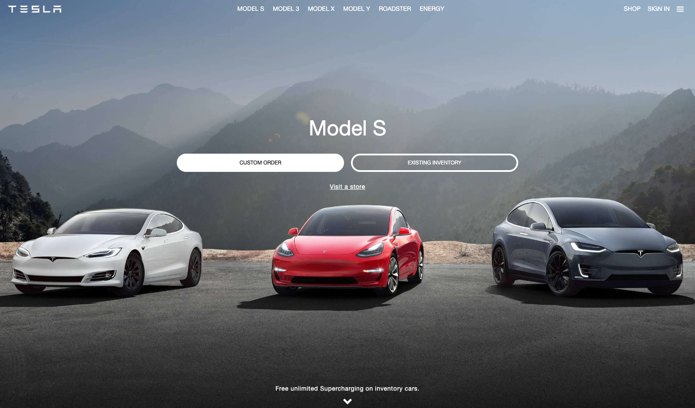
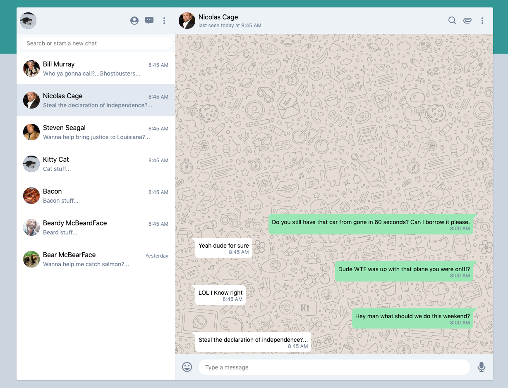
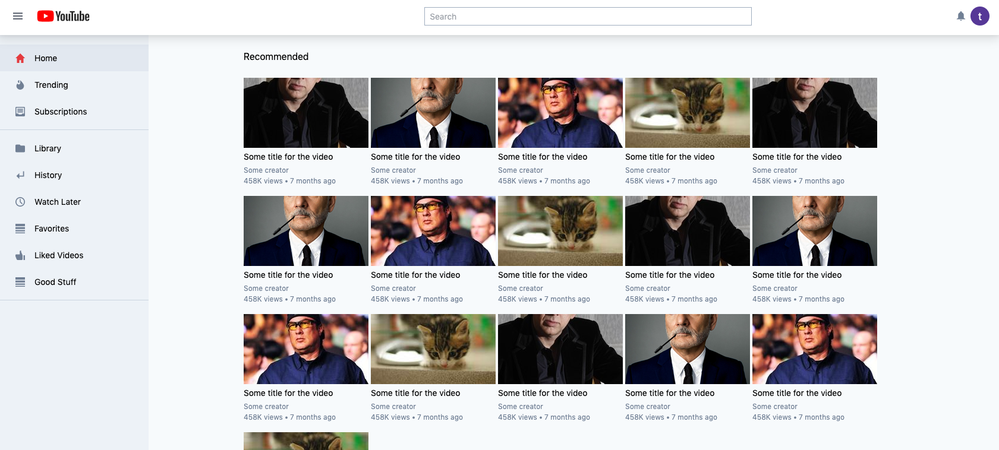
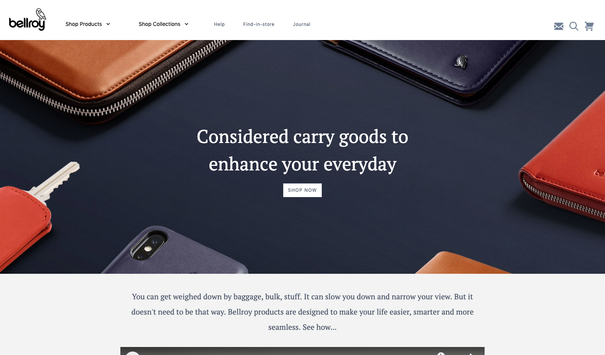
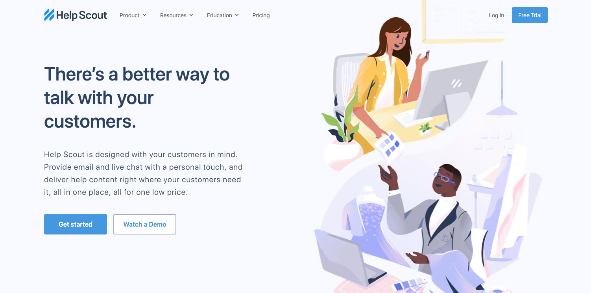
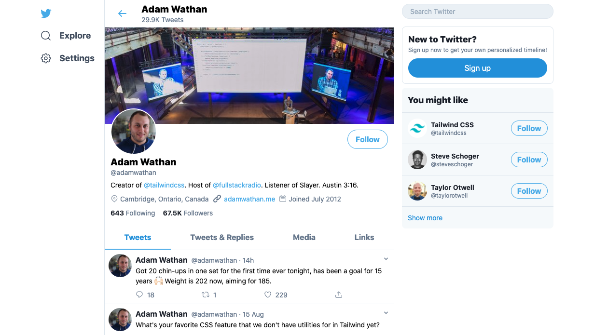

# Tailwind CSS Website Clones (Tailwind CSS examples)
These are website clones/examples made using [Tailwind CSS](tailwindcss.com). 
## What is this about?
The goal is to use as much of the default CSS as possible to try make UI's of various websites. Icons are sourced from [Zondicons](zondicons.com) and I try to match the subject as much as possible. Any custom CSS needed is included in each file. The tailwind CDN is being used as the source of the CSS so you dont need to compile anything. They are built to varying degrees of responsiveness...so they may look a bit off on smaller screens.

The list so far: 
* Tesla - [demo](https://frosty-feynman-7686e6.netlify.com/tesla)
* Youtube - [demo](https://frosty-feynman-7686e6.netlify.com/youtube)
* Bellroy - [demo](https://frosty-feynman-7686e6.netlify.com/bellroy)
* Whatsapp - [demo](https://frosty-feynman-7686e6.netlify.com/whatsapp)
* HelpScout - [demo](https://frosty-feynman-7686e6.netlify.com/helpscout)
* Twitter - [demo](https://frosty-feynman-7686e6.netlify.com/twitter)

## What these things look like

